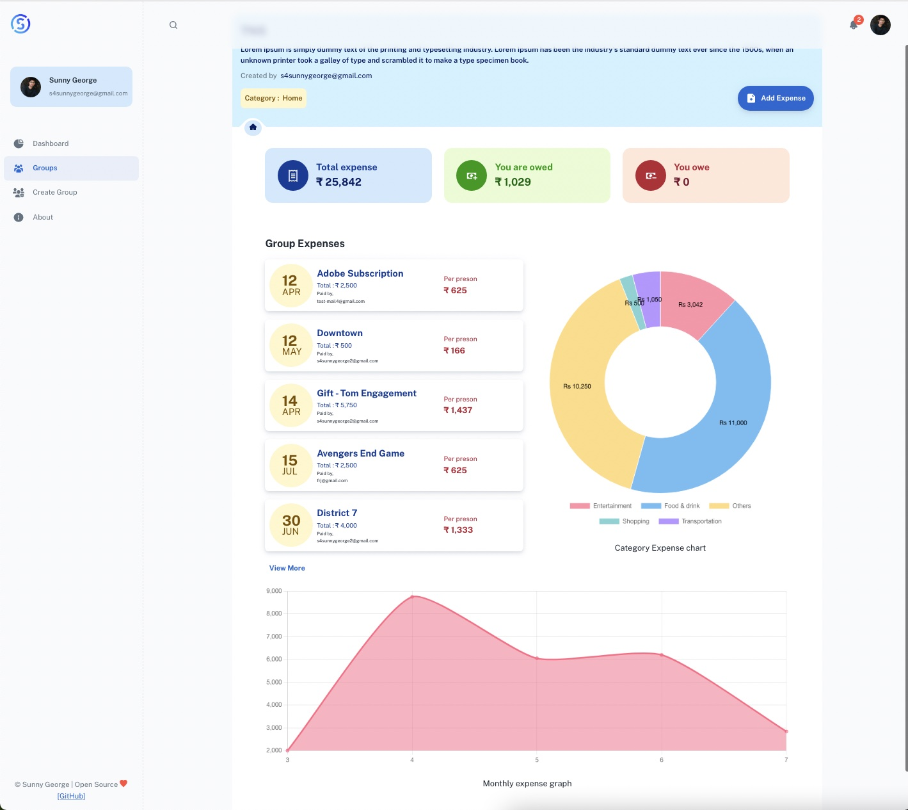
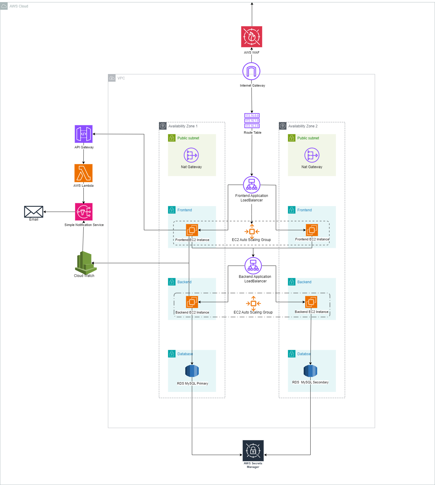

# SplitApp Cloud Architecture
This project demonstrates the deployment of the application on the cloud using AWS services, adhering to the AWS Well-Architected Framework. The application backend is built with Express & Nodejs, the frontend with React, and the database is managed using MongoDB.


  


<div align="center">
  <a href="https://splitapp-rnjo.onrender.com/">
    
  </a>

  <h2 align="center">SplitApp</h2>
  <p align="center">
    Build with the MERN stack (MongoDB, Express, React and NodeJS).
    <br />
    <a href="https://github.com/tuzup/SplitApp/"><strong>Explore the docs »</strong></a>
    <br />
    <br />
    <a href="https://splitapp-rnjo.onrender.com/">View Demo</a>
    ·
    <a href="https://github.com/tuzup/SplitApp/issues">Report Bug</a>
    ·
    <a href="https://github.com/tuzup/SplitApp/issues">Request Feature</a>
  </p>
</div>


## MERN Stack Group Expense Splitting Application

  * [Introduction](#introduction)
  * [Key Features](#key-features)
  * [Technologies used](#technologies-used)
      - [Frontend](#frontend)
      - [Backend](#backend)
      - [Database](#database)
  * [Configuration and Setup](#configuration-and-setup)
  * [License](#license)


## Introduction
This is a side project I've been working on. A full stack expense spliting app - splitwise clone made using the MERN stack (MongoDB, Express, React & Nodejs), specially designed to split group expense between friends. With this application, you can add your expense details and get an whole expense analytics feature - Group Balance, Monthly amount spend, Catagory wise expense spending graph etc... Jump right off the [Live App](https://splitapp-rnjo.onrender.com/) and start adding your expenses or download the entire [Source code](https://github.com/tuzup/SplitApp/) and run it on your server. This project is something I've been working on in my free time so I cannot be sure that everything will work out correctly. But I'll appreciate you if can report any issue.




## Application Features
- Create user groups and track group expense 
- Keep track of shared expenses and settle your corresponding balances in a convenient and personalized way. 
- Get Analytical graphs to understand your expenditure trend 
- Multiple user registration.
- Authentication using JSON web token (JWT) 

## Architectural Fetures

**Compute**:
  * Application servers deployed on EC2 instances behind an Auto Scaling Group to ensure high availability and fault tolerance.
  * Frontend served via S3 Website hosting for fast and secure content delivery.
     
**Networking**:
  * Enforced security via VPC with public and private subnets.
  * Application Load Balancer for routing and distributing traffic.
    
**Database**:
  * MySQL database hosted on Amazon DocumentDB, optimized for multi-AZ deployments.
  * Credentials securely managed using AWS Secrets Manager.
    
**Serverless Components**:
  * AWS Lambda for processing background tasks.
  * API Gateway for efficient and scalable API management.
    
**Monitoring and Logging**:
  * Application metrics and logs managed using Amazon CloudWatch.


## Architecture Diagram


## Technologies used
This project was created using the following technologies.

#### Frontend

- React JS
- Redux (for managing and centralizing application state)
- Axios (for making api calls)
- Material UI (for User Interface)
- Chart.js (To display various analytics graphs)
- React-chartjs-2  
- Gravitar (for user profile picture)

#### Backend

- Express
- Mongoose
- JWT (For authentication)
- bcryptjs (for data encryption)

#### Cloud Services

**AWS Services**: 

EC2, RDS, S3, VPC, Lambda, API Gateway, CloudFront, Cognito, SQS, SNS, CloudWatch, CloudTrail, Secrets Manager

#### Database
MongoDB (MongoDB Atlas) & DocumentDB (AWS)

## Configuration and Setup
In order to run this project locally, simply fork and clone the repository or download as zip and unzip on your machine. 
- Open the project in your prefered code editor.
- Go to terminal -> New terminal (If you are using VS code)
- Split your terminal into two (run the client on one terminal and the server on the other terminal)

In the first terminal
```
$ cd client
$ npm install (to install client-side dependencies)
$ npm start (to start the client)
```

For setting up backend
- cd create a .env file in the root of your directory.
- Supply the following credentials

```
PORT=3001
MONGODB_URI=
ACCESS_TOKEN_SECRET=

```

Please follow [This tutorial](https://dev.to/dalalrohit/how-to-connect-to-mongodb-atlas-using-node-js-k9i) to create your mongoDB connection url, which you'll use as your MONGODB_URI

Provide some random key in ACCESS_TOKEN_SECRET or you could generate one using node enter the below command in the terminal to genrate a random secret key 

```
node -e "console.log(require('crypto').randomBytes(256).toString('base64'));"
```

In the second terminal (*in the project root directory (back-end))

```
$ npm install (to install server-side dependencies)
& npm start (to start the server)
```


### If Using Cloud Formation, simply follow the below Steps.

### Pre-requisites

- AWS account with sufficient permissions.
- Docker installed locally for testing containerized builds.
## Deployment Steps

- Clone the repository:
```
git clone https://github.com/LuvPatel/SplitApp-AWS
```
Configure AWS credentials locally.

#### Deploy the infrastructure using CloudFormation:

``` 
aws cloudformation deploy
```

Monitor the application using **CloudWatch** and validate the deployment.

## License

This project is MIT licensed.
